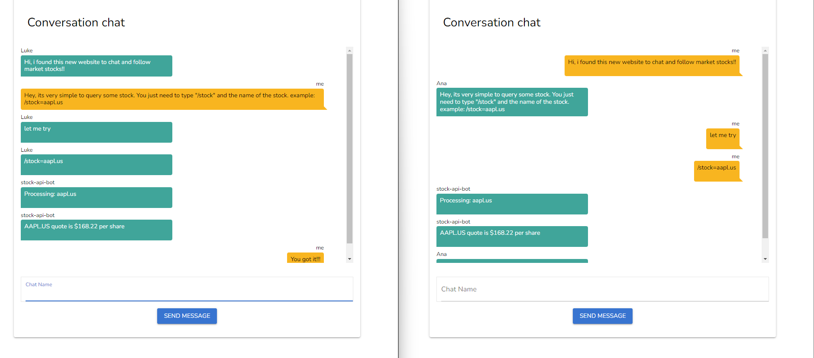

# Real-Time Chat Application with Multiple Rooms

This project is a real-time chat application that allows users to create and join chat rooms. It uses WebSocket for communication and integrates a stock API bot powered by RabbitMQ.


## Features

- **Real-Time Messaging**: Users can send and receive messages instantly within chat rooms.
- **Multiple Rooms**: Create and join different chat rooms.
- **Stock API Bot**: Interact with the `/stock` command to get stock information (e.g., `/stock=aapl.us`).

## Prerequisites

Make sure you have the following installed:

- **Docker**: To run the application, ensure Docker is installed on your system.

## Getting Started

1. Clone this repository:

    ```bash
    git clone https://github.com/MauricioMilano/stock_chat_app.git
    ```

2. Navigate to the project directory:

    ```bash
    cd stock-chat-app
    ```

3. Run the following command to start the application (ensure Docker is running):

    ```bash
    docker-compose up -d
    ```

4. Access the application in your browser at `http://localhost:8081`.

## Usage

1. Register or log in if you already have an account.
2. Click on "Create Room" to create a new chat room.
3. Start chatting with other users in the room.
4. Use the stock API bot by typing `/stock=<symbol>` (e.g., `/stock=aapl.us`) to get stock information.

## Technologies Used
- **Quasar V1 (Vue2)**: Frontend framework for chat ui
- **Golang**: Backend framework for WebSocket communication and the Worker.
- **WebSocket**: Real-time messaging protocol.
- **RabbitMQ**: Message broker for handling stock API requests.
- **Docker**: Containerization for easy deployment.

